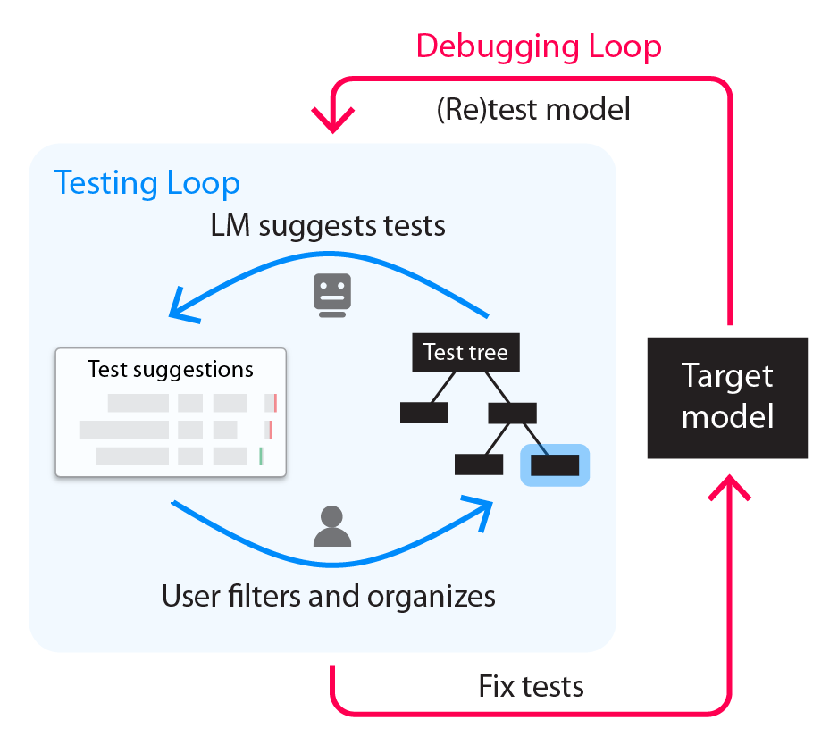
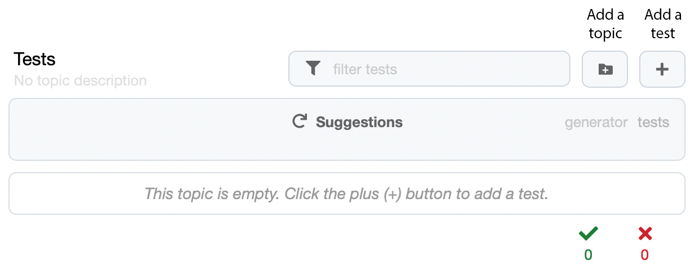
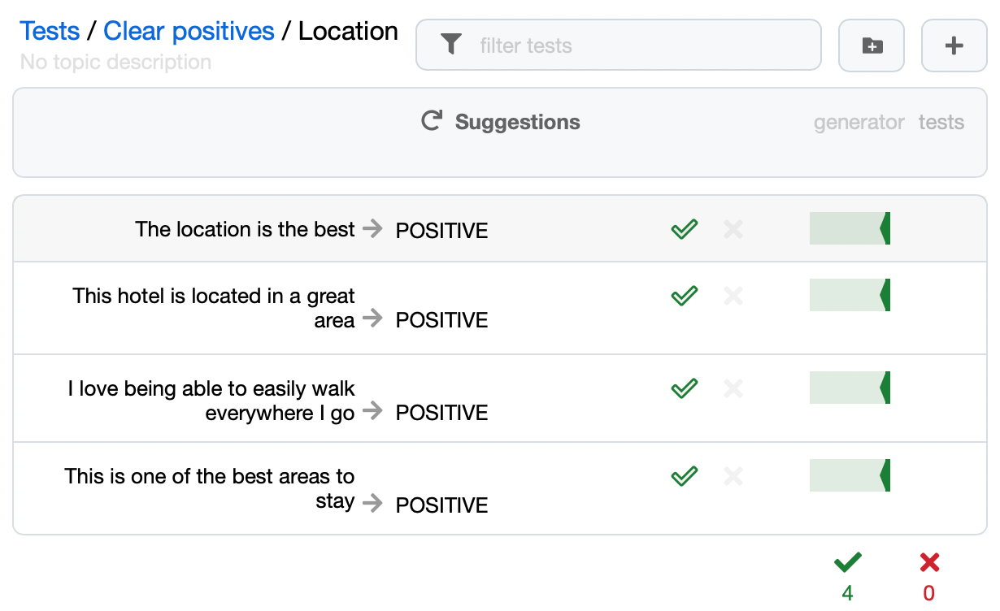
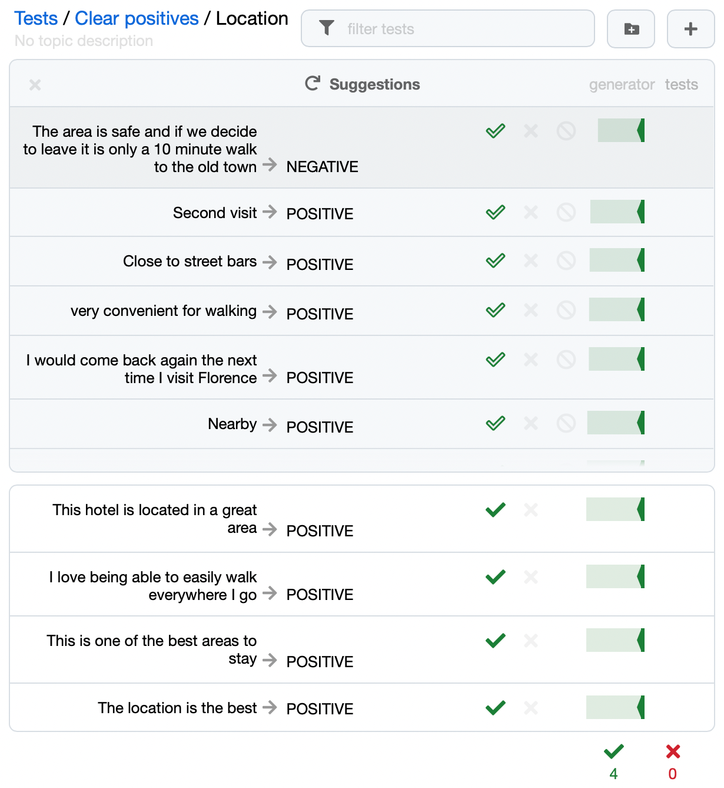
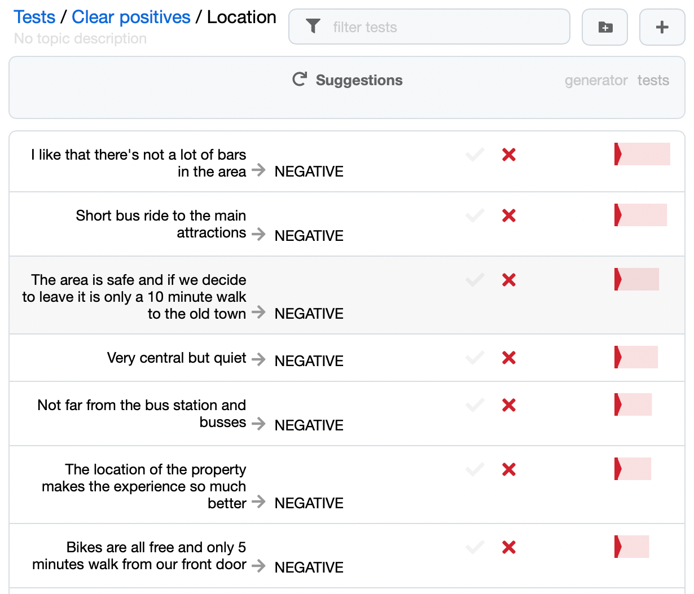
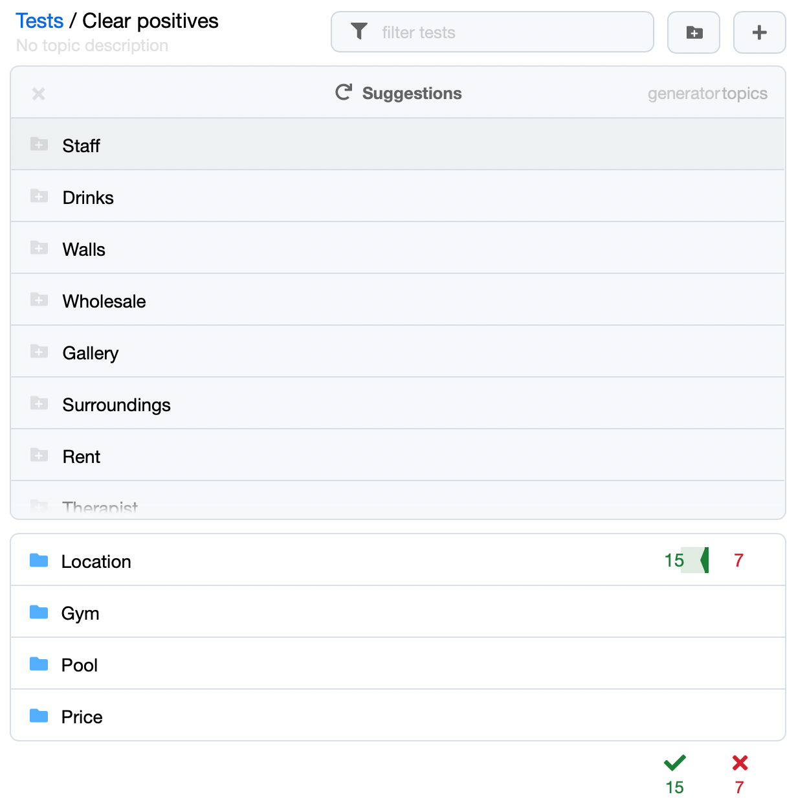
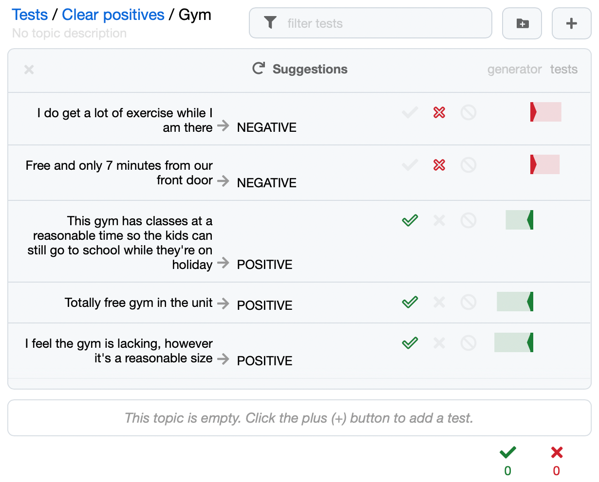

# adaptive-testing
adaptive-testing uses language models against themselves to build suites of unit tests. It is an interative (and fun!) process between a user and a language model that results in a tree of unit tests specifically adapted to the model you are testing. Fixing any failed tests with fine-tuning then leads to an iterative debugging process similar to traditional software development. See <a href="https://aclanthology.org/2022.acl-long.230">paper</a> for details.

<p align="center">
  <br/>
  <smaller><i>Note, adaptive-testing is currently a beta release so please share any issues you encounter.</i></smaller>
</p>

## Install

```
pip install adatest
```

## Sentiment analysis example

adaptive-testing can test any NLP model you can call with a python function, here we will test a basic open source sentiment analysis model. Since adaptive-testing relies on a generative language model to help you create tests, you need to specify what generative model it will use, here we use GPT-3 from OpenAI or GPT-Neo locally. Tests are organized into a test tree that follows the DataFrame API and is organized like a file system, here we create a new empty tree, but you can also start with a previous test tree that targets a similar task. The core adaptive-testing loop starts when you call the `.adapt()` method on a test tree passing the model(s) you want to test and the backend generator you want to use. The code for all this is below:

```python
import transformers
import adaptivetesting

# create a HuggingFace sentiment analysis model
classifier = transformers.pipeline("sentiment-analysis", return_all_scores=True)

# specify the backend generator used to help you write tests
generator = adaptivetesting.generators.OpenAI('curie', api_key=OPENAI_API_KEY)

# ...or you can use an open source generator
#neo = transformers.pipeline('text-generation', model="EleutherAI/gpt-neo-125M")
#generator = adaptivetesting.generators.Transformers(neo.model, neo.tokenizer)

# create a new test tree
tests = adaptivetesting.TestTree("hotel_reviews.csv")

# adapt the tests to our model to launch a notebook-based testing interface
# (wrap with adaptivetesting.serve to launch a standalone server)
tests.adapt(classifier, generator, auto_save=True)
```

<p align="center">
  
</p>

Once we have launched a test tree browser, we can use the interface to create new topics and tests. Here we create the topic "/Clear positives/Location" to test how well this model classifies clearly positive statements about a hotel's location. We then add a few starting examples of what we want to see in this topic (clearly positive statements about hotel location):

<p align="center">
  
</p>

Each test consists of a model input, a model output, a pass/fail label, and a score for the current target model. The input text should fall within the scope of the current topic, which here means it is a clearly positive statement about hotel locations. The output text is what the target model we are testing generated (or it can be manually specified, in which case it turns light grey to show it does not reflect the current model behavior). The label is a pass/fail indicator that denotes if the model output is correct with respect to the aspect being tested in the current topic, in our case the model was correct for all the inputs we entered. The model score represents if the testing model passes or fails and how confident the model is when producing the current output.

Note that in the above figure all the label indicators are hollow, this means that we have not yet labeled these examples, and adaptive-testing is just guessing that they are correct. They are all correct so can click the checkmarks to confirm and label all these examples. By confirming we teach adaptive-testing more about what we want this topic to test, so it becomes better at predicting future labels, and hence automating the testing process. Once we label these examples we can then click "Suggestions" and adaptive-testing will attempt to write new in-topic examples for us, labeling them and sorting then by score so we can see the most likely failures at the top of the list.

<p align="center">
  
</p>

Starting at the top of the list we can confirm or change the label for each suggestion and so add them to the current topic (like marking "very convientent for walking" -> "POSITIVE" as correct model behavior), while we reject (or just ignore) examples that don't belong in the current topic (like "Second visit" which is not about a hotel's location). After we have added some new suggestions to the current topic (we normally only bother to look at the top few suggestions) we can repeat the process by clicking "Suggestions" again. Repeating the process a few times allows adaptive-testing to learn from our feedback and hill-climb towards generating better and better suggestions (ones that are more likely to be on-topic and reveal model failures). Doing this for a few rounds reveals lots of bugs in the model related to positive hotel location statements.

<p align="center">
  
</p>

Once we have testing the location aspect enough we can repeat the process to test a new aspect of model behavior, for example comments about hotel swimming pools or gyms. The space of possible concepts for hotel reviews is large, so to help explore it adaptive-testing can suggest new topics once we have a few examples:

<p align="center">
  
</p>

After we accept some of these new topic suggestions we can open them and fill them out without ever even writing seed examples. adaptive-testing can suggest new tests inside an empty topic by just using examples other topics and the current topic's name.

<p align="center">
  
</p>

This is just a short example of how to find bugs in a sentiment analysis model, but the same process can be applied to any NLP model (even ones that generate free form text). Test trees can be adapted to new models and shared with others collaboratively (they are just CSV files). Once you have enough bugs you can fine tune your model against a mixture of your test tree and the original training data to fix all the bugs in the test tree while retaining performance on your original training data (we will share a full demo notebook of this soon).


## Citation

If you find adaptive-testing or test trees useful in your work feel free to cite our ACL paper:
[Adaptive Testing and Debugging of NLP Models](https://aclanthology.org/2022.acl-long.230) (Ribeiro & Lundberg, ACL 2022)

## Contributing

This project welcomes contributions and suggestions.  Most contributions require you to agree to a
Contributor License Agreement (CLA) declaring that you have the right to, and actually do, grant us
the rights to use your contribution. For details, visit https://cla.opensource.microsoft.com.

When you submit a pull request, a CLA bot will automatically determine whether you need to provide
a CLA and decorate the PR appropriately (e.g., status check, comment). Simply follow the instructions
provided by the bot. You will only need to do this once across all repos using our CLA.

This project has adopted the [Microsoft Open Source Code of Conduct](https://opensource.microsoft.com/codeofconduct/).
For more information see the [Code of Conduct FAQ](https://opensource.microsoft.com/codeofconduct/faq/) or
contact [opencode@microsoft.com](mailto:opencode@microsoft.com) with any additional questions or comments.

## Trademarks

This project may contain trademarks or logos for projects, products, or services. Authorized use of Microsoft 
trademarks or logos is subject to and must follow 
[Microsoft's Trademark & Brand Guidelines](https://www.microsoft.com/en-us/legal/intellectualproperty/trademarks/usage/general).
Use of Microsoft trademarks or logos in modified versions of this project must not cause confusion or imply Microsoft sponsorship.
Any use of third-party trademarks or logos are subject to those third-party's policies.
